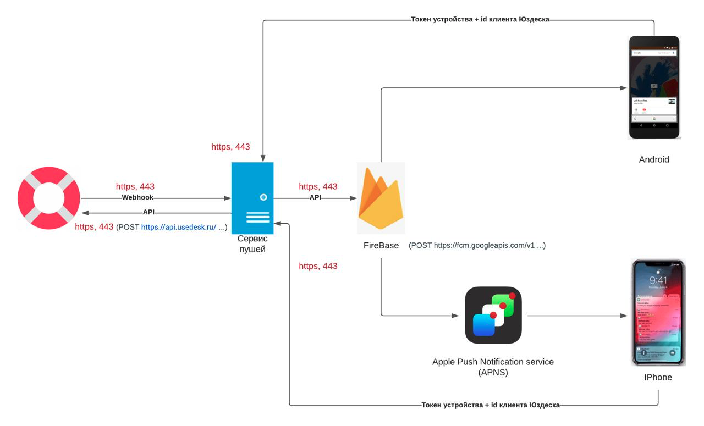
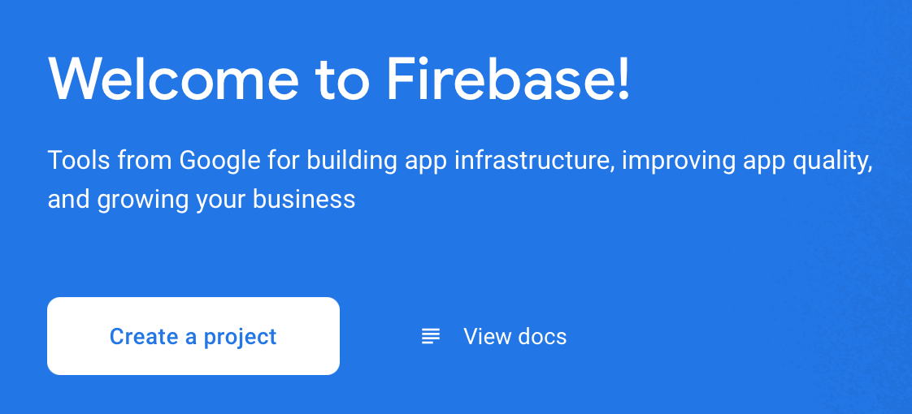
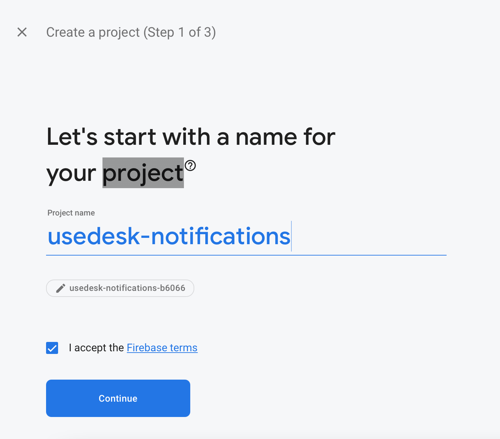
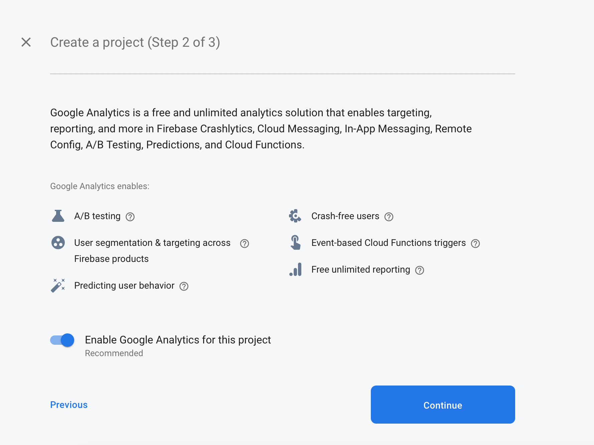
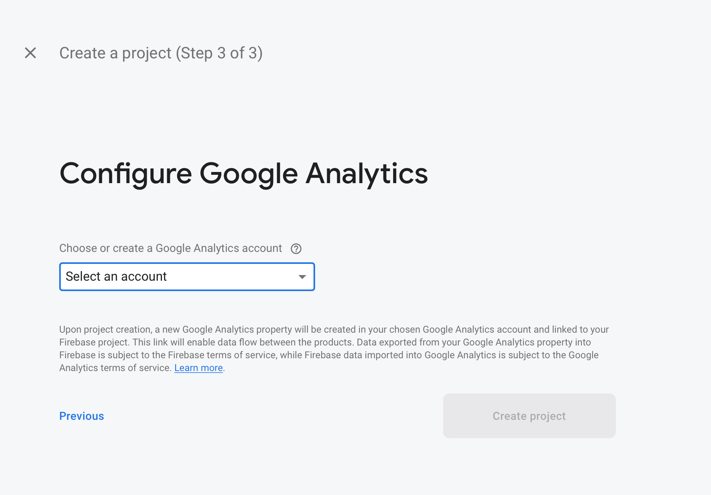
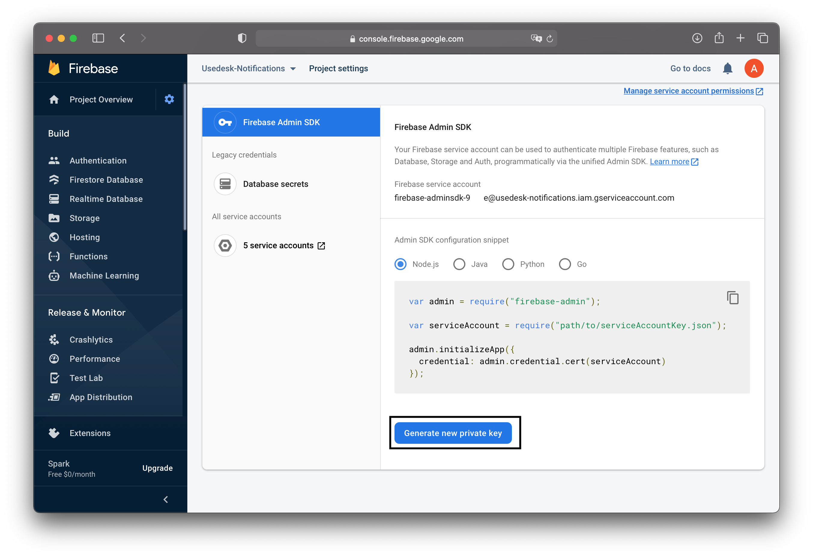

[TOC]


# Как работают уведомления?

1. Мобильное приложение предлагает пользователю получать уведомление от сервера;
2. Мобильное приложение подключается к серверу сообщений и регистрируется;
3. Сервер сообщений возвращает на устройство уникальный токен
4. Приложение отправляет полученный токен серверному приложению, вместе с идентификатором клиента, в итоге токен привязывается к конкретному пользователю и его устройству;
5. Сервер отправляет запрос через API к серверу сообщений;
6. Сервер сообщений отправляет Push уведомление на устройство.

Мы реализовали работу с API [Google Firebase Cloud Messaging](https://firebase.google.com/docs/cloud-messaging).

Ниже приведена схема обмена данными между элементами такой интеграции: 



# Создание проекта в Firebase

Начнем с регистрации и создания проекта на Firebase:

1. Заходим на [сайт](https://console.firebase.google.com);

2. Регистрируемся;

3. Кликаем на "Create a project";

   

4. Задаем имя проекту;

   

5. Включаем (или не включаем) Google Analytics;

   

6. Если Google Analytics на предыдущем включена, то выбираем аккаунт Google Analytics;

   

7. После создания проекта попадаем в Dashboard;

На этом создание проекта в Firebase закончено

# Интеграция SDK Firebase в приложение

Для работы с Firebase реализован SDK для различных платформ. Подробно о том, как внедрить его в свое приложение, описано в руководствах: для [iOS](https://firebase.google.com/docs/cloud-messaging/ios/client) и для [Android](https://firebase.google.com/docs/cloud-messaging/android/client). У вашего провайдера может быть предусмотрен свои методы интеграции с приложением, подробно о реализации можете уточнить у них. 

# Сервис (aka серверная часть)

## Возможности

Что умеет делать серверная часть: 

1. Получает от Юздеска вебхуки;
2. Отправляет по API запросы к FireBase с уведомлением. Заголовок: Новое сообщение от поддержки, текст: %начало ответа%;
3. Обеспечивает сохранение пары `токен <> id клиента` Юздеска с помощью POST-запроса;
4. Хранит эти пары;
5. Обеспечивает их удаление с помощью DELETE-запроса.

# Разворот на своем сервере

## Требования к конфигурации сервера для развертывания сервиса

- ОС: Ubuntu LTS или Debian;
- Node.js: мажорная версия 14;
- MySQL: версия 5.7;
- SSL-сертификат.

## Процесс установки

1. Загрузить код на сервер;
2. Отредактировать конфигурационный файл example.env — добавить свой API-токен из Юздеска, настроить подключение к базе данных и порты для подключения:  

```
DB_HOST = localhost //Хост БД
DB_USER = user //имя пользователя базы БД
DB_PASSWORD = secret //Пароль пользователя БД
DB_NAME = service //Название базы данных 
USEDESK_API_TOKEN = ebd869f5c67413382... //Токен API-канала в Юздеске%
PORT = 80 //Порт подключения HTTP
SSL_PORT = 443 // Порт подключения SSH
```

3. Переименовать example.env в .env;

4. Установить ваши SSL-сертификаты для корректной работы HTTPS протокола. Названия оставить как в примере: ssl.crt и ssl.key;

5. Сгенерировать в консоли Firebase новый приватный ключ для доступа по API

   

6. Полученный файл переименовать в credential.json и загрузить в корень проекта;

7. Собрать проект:   `npm run build`

## Метод добавления токена устройста в БД  
После того, как приложение получило разрешение на уведомления от пользователя, сервис сообщений генерирует уникальный токен для конкретного устройства. Именно по нему происходит отправка сообщений. Для того, чтобы сервис знал, какие устройства принадлежат конкретному клиенту, в нем предусмотрена база данных. Для записи необходимо отправить запрос к API сервиса:

`POST /notification/token`   

В качестве параметров метод ожидает следующие параметры:  

```
    {
            "recipient_id": dehwuwo13j12223...,
            "token": "e3OWEB57duf8Wkqk_aiwh9:...",
            "recipient_type": "USEDESK_CHAT",
            "locale": "en"
    }
```

где:

- recipient_id — токен чата клиента в Юздеске  
- token — токен Firebase  
- recipient_type — тип получателя. В данной реализации всегда "USEDESK_CHAT"  
- locale — язык для заголовка уведомления

## Метод удаления токена устройства из БД

Для удаления токена устройства из базы данных необходимо отправить запрос к API сервиса: 

`DELETE /notification/token`

В качестве параметров метод ожидает следующие параметры:  

```
    {
            "token": "e3OWEB57duf8Wkqk_aiwh9:...",
    }
```

где:  

- token — токен устройства, который нужно удалить из БД
  
## Настройка отправки запросов с новыми сообщениями от Юздеска

Пришло время настроить исходящие запросы от Юздеска. О настройке API-канала подробно рассказали в [статье](https://docs.usedesk.ru/article/10167). 
    
Необходимые настройки:
    
- Redirect URL:  `{{host}}/notification/post;`
- Следить за каналами: установите канал SDK
- В разделе "Отслеживание чатов" необходимо отметить "Новый комментарий".